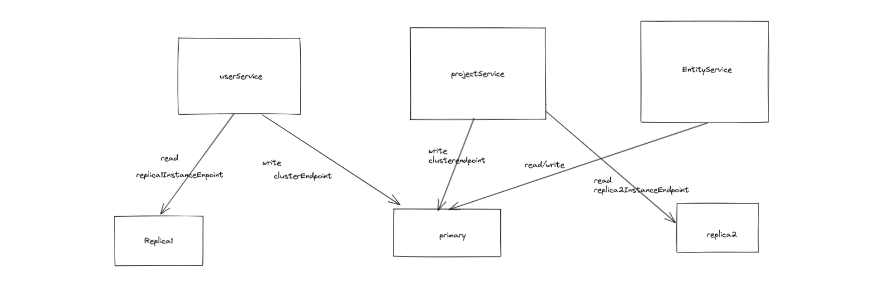

# team-workspace
Simple Team workspace using gRPC


## Steps
- [ ] Understand gRPC and implementation in Node - Day 1
- [ ] Prototype simple gRPC client and server - Day 1
- [ ] High Level system architecture - Day 1
- [ ] Database Design - Day 1
- [ ] Low level Design - Day 1
- [ ] Implement Backend - Day 2
- [ ] Deployment scripts - Day 2
- [ ] E2E Test Day 2

## Deployment 
To deploy on server all the microservices can be composed by running docker-compose as below
- ```docker-compose -p <any-name> up -d```

For public internet facing use cse , you can proxy_pass apiService behind a nginx

Sample Nginx server block assuming you are binding apiService to port 8010

``` 
server {
        listen 80;
        listen [::]:80;


        location /api {
            include proxy_params;
            proxy_pass http://127.0.0.1:8010;
        }
} 
```


## Implementation Details

There will be 4 services
- userService: responsible for all operations associated with user
- projectService: responsible for all operations associated with project 
- entityService: responsible for all operations associated with  files and folders
- apiGatewayService: routing api calls to all the services and a proxy server to handle HTTP 1.0 requests from frontend


### Database design:
As per requirement each project's data should reside in separate dbs
There will be a 'TeamsDB' which will contain following collections
- user
- project

And Each project will have its on db named after its Id and will host following collection
- entity : details of files, folders and its properties


### Handling Database Reads/write to unique instances:
As per requirements, 
- Find operations to the Users collection should be performed on replica 1
- Find operations to the Projects collection should be performed on a replica 2
- Find operations to the Files/Folders collection should be performed on the primary node

This will be handled by maintaining a DB connection pool within the service and this connection will be used to access data from DB
Eg: userService will have two connections opened
- Conn1: will issue connection as replicaSet=rs0 and connect to primary. this connection will be used for all writes to user collection
- Conn2: will issue connection using the instance endpoint of replica1 server. this will be used for all read operations


